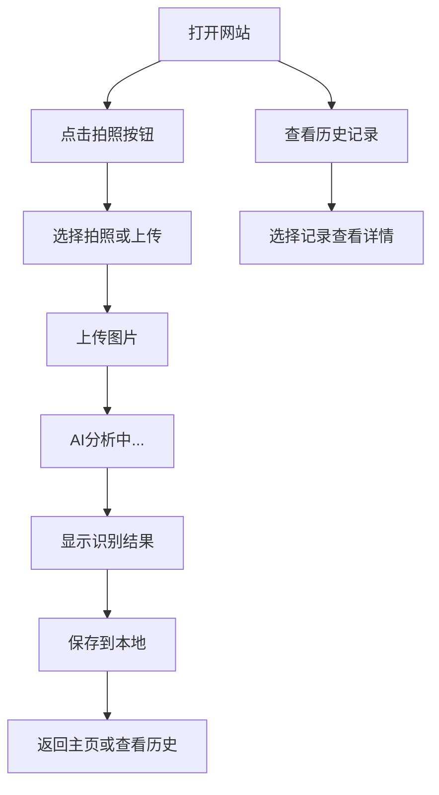

# 糖尿病管理 MVP 核心功能文档

## 1. 产品概述

这是一个专注于核心功能的MVP版本，围绕**快速识别 → 拍照 → 分析 → 结果展示 → 保存**这一条主线流程设计。

目标：让用户能够快速拍照上传图片，通过AI自动识别食物或血糖检测结果，并查看分析结果。

## 2. 核心功能

### 2.1 MVP功能范围

**包含功能：**
- ✅ 拍照上传功能
- ✅ AI图片识别分析
- ✅ 结果展示界面
- ✅ 简单保存功能
- ✅ 历史记录查看（本地缓存）

**暂不包含：**
- ❌ 手动记录功能
- ❌ 语音记录功能
- ❌ 复杂的数据统计
- ❌ 数据库存储
- ❌ 用户账户系统

### 2.2 页面结构

我们的MVP只需要3个核心页面：

1. **主页面**：拍照上传入口
2. **分析页面**：AI处理和结果展示
3. **历史页面**：查看之前的记录

### 2.3 功能详情

| 页面名称 | 模块名称 | 功能描述 |
|----------|----------|----------|
| 主页面 | 拍照卡片 | 大按钮，支持拍照或选择图片上传 |
| 主页面 | 历史入口 | 简单按钮，查看之前的识别记录 |
| 分析页面 | 图片预览 | 显示用户上传的图片 |
| 分析页面 | AI分析状态 | 显示"分析中"的加载动画 |
| 分析页面 | 结果展示 | 显示识别结果和基本建议 |
| 分析页面 | 保存按钮 | 将结果保存到本地缓存 |
| 历史页面 | 记录列表 | 显示之前保存的识别记录 |
| 历史页面 | 记录详情 | 点击查看单条记录的详细信息 |

## 3. 用户流程

### 主要操作流程：



**详细步骤：**
1. 用户打开网站，看到大大的"快速识别"按钮
2. 点击按钮，可以选择拍照或从相册选择图片
3. 上传图片后，页面显示"AI分析中"的动画
4. 几秒后显示识别结果（食物信息或血糖数据）
5. 用户可以选择保存这条记录
6. 保存后可以在历史记录中查看

## 4. 界面设计

### 4.1 设计原则
- **简洁至上**：每个页面只有必要的元素
- **大按钮设计**：方便手机用户操作
- **清晰反馈**：每个操作都有明确的状态提示
- **绿色主题**：使用医疗绿色，给人安全感

### 4.2 页面布局

**主页面：**
- 顶部：简单的标题"AI糖尿病管理"
- 中间：大大的绿色"快速识别"按钮（占屏幕1/3）
- 底部：小的"查看历史"按钮

**分析页面：**
- 顶部：返回按钮
- 中间：上传的图片预览
- 下方：分析状态或结果展示
- 底部：保存按钮

**历史页面：**
- 顶部：返回按钮和标题
- 中间：记录列表（时间 + 识别类型 + 简要结果）
- 每条记录可点击查看详情

### 4.3 响应式设计
- **移动端优先**：主要针对手机用户设计
- **桌面端兼容**：在电脑上也能正常使用
- **触摸友好**：所有按钮都足够大，方便点击

## 5. 技术实现

### 5.1 技术栈
- **框架**：Next.js + TypeScript + Tailwind CSS
- **特性**：文件路由系统、API路由、服务端渲染
- **状态管理**：React useState（简单状态）
- **数据存储**：localStorage（本地缓存）
- **图片处理**：浏览器 File API + Next.js 文件上传
- **AI接口**：预留接口，后续对接

### 5.2 核心组件（基于Next.js结构）
```
pages/
├── index.tsx              # 主页面
├── analysis.tsx           # 分析页面
├── history.tsx            # 历史记录页面
└── api/
    └── analyze.ts         # AI分析API（预留）

components/diabetes-mvp/
├── PhotoCapture.tsx       # 拍照上传组件
├── AIAnalysis.tsx         # AI分析组件
├── ResultDisplay.tsx      # 结果展示组件
├── HistoryList.tsx        # 历史记录组件
└── types.ts              # 类型定义
```

### 5.3 数据结构
```typescript
// 识别记录的数据结构
interface RecognitionRecord {
  id: string;                    // 唯一ID
  timestamp: string;             // 记录时间
  imageUrl: string;              // 图片地址（base64）
  type: 'food' | 'glucose';      // 识别类型
  result: {                      // 识别结果
    name: string;                // 名称
    confidence: number;          // 置信度
    details: any;                // 详细信息
  };
  suggestions: string[];         // 建议
}
```

### 5.4 本地存储
```typescript
// 保存记录到本地
const saveRecord = (record: RecognitionRecord) => {
  const records = JSON.parse(localStorage.getItem('diabetes-records') || '[]');
  records.unshift(record); // 新记录放在最前面
  localStorage.setItem('diabetes-records', JSON.stringify(records));
};

// 获取历史记录
const getRecords = (): RecognitionRecord[] => {
  return JSON.parse(localStorage.getItem('diabetes-records') || '[]');
};
```

## 6. 开发计划

### 第一阶段：基础框架（1-2天）
- [ ] 创建基础组件结构
- [ ] 实现页面路由
- [ ] 设计基础UI样式

### 第二阶段：核心功能（2-3天）
- [ ] 实现拍照上传功能
- [ ] 创建AI分析界面（模拟数据）
- [ ] 实现结果展示页面
- [ ] 添加本地存储功能

### 第三阶段：完善体验（1天）
- [ ] 添加加载动画
- [ ] 优化移动端体验
- [ ] 测试各种场景

### 第四阶段：API对接（后续）
- [ ] 对接真实的AI识别API
- [ ] 处理错误情况
- [ ] 优化识别准确度

## 7. 成功标准

**MVP成功的标准：**
1. ✅ 用户能够顺利拍照或上传图片
2. ✅ 页面能够显示"分析中"的状态
3. ✅ 能够展示模拟的识别结果
4. ✅ 用户能够保存和查看历史记录
5. ✅ 在手机上使用体验良好
6. ✅ 页面加载速度快，操作流畅

这个MVP版本专注于核心功能，让用户能够快速体验到产品的价值，为后续功能扩展打下基础。