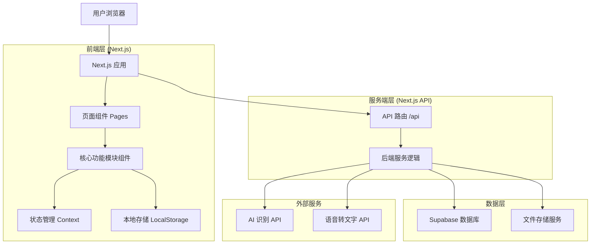
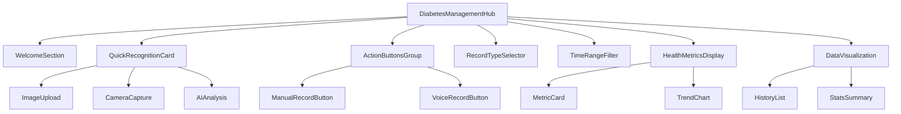
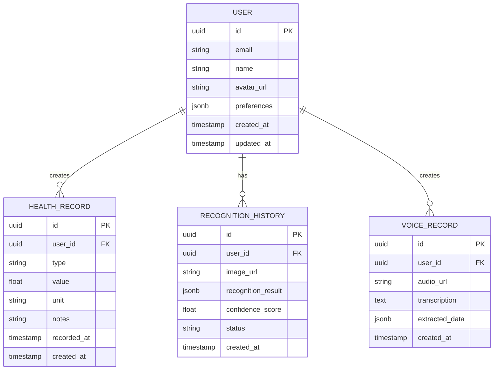

# 糖尿病管理核心功能模块技术架构文档

## 1. 架构设计



## 2. 技术描述

- **框架**: Next.js@14 + TypeScript + Tailwind CSS + Framer Motion
- **特性**: 服务端渲染(SSR)、文件路由系统、API 路由、内置优化
- **状态管理**: React Context + useReducer
- **数据存储**: Supabase (PostgreSQL) + 本地存储
- **文件处理**: 浏览器 File API + Canvas API + Next.js 文件上传
- **图表库**: Chart.js + React-Chartjs-2
- **表单处理**: React Hook Form + Zod 验证
- **多语言**: 集成现有 Next.js i18n 系统

## 3. 路由定义

基于 Next.js 文件路由系统：

| 路由 | 文件路径 | 用途 |
|------|----------|------|
| / | pages/index.tsx | 主页，包含核心功能模块 |
| /dashboard | pages/dashboard.tsx | 用户仪表板，详细数据分析 |
| /history | pages/history.tsx | 历史记录页面，数据管理 |
| /settings | pages/settings.tsx | 用户设置，偏好配置 |
| /api/recognition/analyze | pages/api/recognition/analyze.ts | 图片识别 API |
| /api/health/records | pages/api/health/records.ts | 健康数据记录 API |
| /api/voice/transcribe | pages/api/voice/transcribe.ts | 语音转换 API |

## 4. API 定义

### 4.1 核心 API

**图片上传和识别**
```
POST /api/recognition/analyze
```

请求参数:
| 参数名 | 参数类型 | 是否必需 | 描述 |
|--------|----------|----------|------|
| image | File | true | 上传的图片文件 |
| type | string | false | 识别类型: 'food' \| 'glucose' \| 'auto' |

响应参数:
| 参数名 | 参数类型 | 描述 |
|--------|----------|------|
| success | boolean | 识别是否成功 |
| data | object | 识别结果数据 |
| confidence | number | 识别置信度 |
| suggestions | array | 健康建议列表 |

示例:
```json
{
  "success": true,
  "data": {
    "type": "food",
    "name": "苹果",
    "calories": 52,
    "carbs": 14,
    "sugar": 10
  },
  "confidence": 0.95,
  "suggestions": [
    "适量食用，有助于控制血糖",
    "建议在餐前30分钟食用"
  ]
}
```

**健康数据记录**
```
POST /api/health/records
```

请求参数:
| 参数名 | 参数类型 | 是否必需 | 描述 |
|--------|----------|----------|------|
| type | string | true | 记录类型: 'glucose' \| 'food' \| 'exercise' |
| value | number | true | 数值 |
| unit | string | true | 单位 |
| timestamp | string | true | 记录时间 |
| notes | string | false | 备注信息 |

**语音转换**
```
POST /api/voice/transcribe
```

请求参数:
| 参数名 | 参数类型 | 是否必需 | 描述 |
|--------|----------|----------|------|
| audio | File | true | 音频文件 |
| language | string | false | 语言代码，默认 'zh-CN' |

## 5. 组件架构设计



## 6. 数据模型

### 6.1 数据模型定义



### 6.2 数据定义语言

**用户健康记录表 (health_records)**
```sql
-- 创建表
CREATE TABLE health_records (
    id UUID PRIMARY KEY DEFAULT gen_random_uuid(),
    user_id UUID NOT NULL,
    type VARCHAR(50) NOT NULL CHECK (type IN ('glucose', 'food', 'exercise', 'medication')),
    value DECIMAL(10,2) NOT NULL,
    unit VARCHAR(20) NOT NULL,
    notes TEXT,
    recorded_at TIMESTAMP WITH TIME ZONE NOT NULL,
    created_at TIMESTAMP WITH TIME ZONE DEFAULT NOW(),
    updated_at TIMESTAMP WITH TIME ZONE DEFAULT NOW()
);

-- 创建索引
CREATE INDEX idx_health_records_user_id ON health_records(user_id);
CREATE INDEX idx_health_records_type ON health_records(type);
CREATE INDEX idx_health_records_recorded_at ON health_records(recorded_at DESC);

-- 权限设置
GRANT SELECT ON health_records TO anon;
GRANT ALL PRIVILEGES ON health_records TO authenticated;
```

**AI识别历史表 (recognition_history)**
```sql
-- 创建表
CREATE TABLE recognition_history (
    id UUID PRIMARY KEY DEFAULT gen_random_uuid(),
    user_id UUID NOT NULL,
    image_url TEXT NOT NULL,
    recognition_result JSONB NOT NULL,
    confidence_score DECIMAL(3,2),
    status VARCHAR(20) DEFAULT 'completed' CHECK (status IN ('processing', 'completed', 'failed')),
    created_at TIMESTAMP WITH TIME ZONE DEFAULT NOW()
);

-- 创建索引
CREATE INDEX idx_recognition_history_user_id ON recognition_history(user_id);
CREATE INDEX idx_recognition_history_created_at ON recognition_history(created_at DESC);
CREATE INDEX idx_recognition_history_status ON recognition_history(status);

-- 权限设置
GRANT SELECT ON recognition_history TO anon;
GRANT ALL PRIVILEGES ON recognition_history TO authenticated;
```

**语音记录表 (voice_records)**
```sql
-- 创建表
CREATE TABLE voice_records (
    id UUID PRIMARY KEY DEFAULT gen_random_uuid(),
    user_id UUID NOT NULL,
    audio_url TEXT,
    transcription TEXT NOT NULL,
    extracted_data JSONB,
    created_at TIMESTAMP WITH TIME ZONE DEFAULT NOW()
);

-- 创建索引
CREATE INDEX idx_voice_records_user_id ON voice_records(user_id);
CREATE INDEX idx_voice_records_created_at ON voice_records(created_at DESC);

-- 权限设置
GRANT SELECT ON voice_records TO anon;
GRANT ALL PRIVILEGES ON voice_records TO authenticated;

-- 初始化示例数据
INSERT INTO health_records (user_id, type, value, unit, notes, recorded_at)
VALUES 
    ('00000000-0000-0000-0000-000000000001', 'glucose', 6.2, 'mmol/L', '早餐前', '2024-01-15 07:30:00'),
    ('00000000-0000-0000-0000-000000000001', 'glucose', 8.5, 'mmol/L', '早餐后', '2024-01-15 09:30:00'),
    ('00000000-0000-0000-0000-000000000001', 'food', 250, 'kcal', '苹果', '2024-01-15 10:00:00');
```

## 7. 核心组件实现规范

### 7.1 组件文件结构
```
src/components/diabetes-management/
├── index.tsx                 # 主入口组件
├── components/
│   ├── WelcomeSection.tsx
│   ├── QuickRecognitionCard.tsx
│   ├── ActionButtonsGroup.tsx
│   ├── RecordTypeSelector.tsx
│   ├── TimeRangeFilter.tsx
│   ├── HealthMetricsDisplay.tsx
│   └── DataVisualization.tsx
├── hooks/
│   ├── useHealthRecords.ts
│   ├── useImageRecognition.ts
│   └── useVoiceRecording.ts
├── types/
│   └── index.ts
└── utils/
    ├── dataProcessing.ts
    └── chartHelpers.ts
```

### 7.2 TypeScript 类型定义
```typescript
// 健康记录类型
export interface HealthRecord {
  id: string;
  userId: string;
  type: 'glucose' | 'food' | 'exercise' | 'medication';
  value: number;
  unit: string;
  notes?: string;
  recordedAt: string;
  createdAt: string;
}

// AI识别结果类型
export interface RecognitionResult {
  type: 'food' | 'glucose' | 'unknown';
  name: string;
  confidence: number;
  nutritionInfo?: {
    calories: number;
    carbs: number;
    sugar: number;
    protein: number;
    fat: number;
  };
  suggestions: string[];
}

// 组件状态类型
export interface DiabetesManagementState {
  records: HealthRecord[];
  selectedTimeRange: '5d' | '7d' | '30d' | 'all';
  selectedRecordType: 'glucose' | 'food' | 'analysis';
  isLoading: boolean;
  error: string | null;
}
```

这个技术架构文档为核心功能模块的开发提供了完整的技术指导，确保实现高质量、可维护的代码。