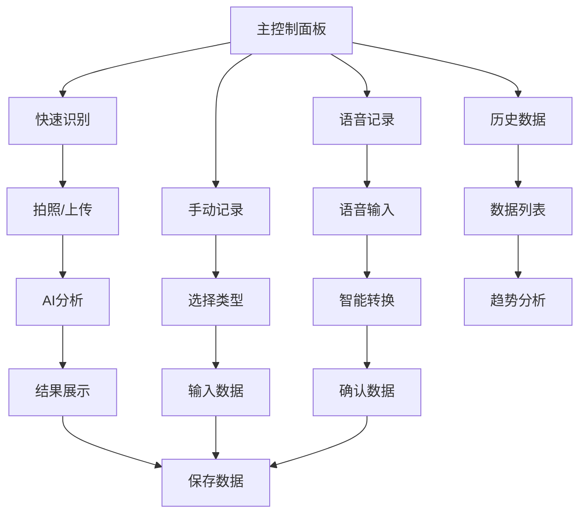

# 糖尿病管理核心功能模块需求文档

## 1. 产品概述

基于移动端设计图分析，我们需要开发一个糖尿病管理的核心功能模块，集成到现有网站首页。该模块提供智能拍照识别、多种数据录入方式、实时数据展示和历史趋势分析等功能，帮助用户便捷地管理血糖和饮食健康。

该模块将成为网站的核心交互区域，为用户提供一站式的糖尿病管理解决方案，通过AI技术简化数据录入流程，提升用户体验。

## 2. 核心功能

### 2.1 用户角色

| 角色 | 注册方式 | 核心权限 |
|------|----------|----------|
| 普通用户 | 邮箱注册/社交登录 | 基础功能使用、数据记录、历史查看 |
| 高级用户 | 付费升级 | 高级分析、导出数据、专业建议 |

### 2.2 功能模块

我们的核心功能模块包含以下主要页面和功能：

1. **主控制面板**：用户欢迎界面、快速操作入口、今日数据概览
2. **智能识别区域**：拍照上传、AI分析处理、结果展示
3. **手动记录面板**：血糖记录、食物记录、运动记录
4. **语音记录功能**：语音输入、智能转换、数据确认
5. **数据展示区域**：实时数据、趋势图表、健康状态
6. **历史记录页面**：数据列表、筛选功能、详细分析

### 2.3 页面详情

| 页面名称 | 模块名称 | 功能描述 |
|----------|----------|----------|
| 主控制面板 | 用户欢迎区 | 显示用户姓名、当前时间、今日概览信息 |
| 主控制面板 | 快速识别卡片 | 大型绿色卡片，包含相机图标和"快速识别"按钮，支持拍照和上传 |
| 主控制面板 | 操作按钮组 | 手动记录、语音记录两个圆形按钮，提供多种输入方式 |
| 主控制面板 | 记录类型选择 | 血糖记录、食物记录、分析记录三个标签页切换 |
| 主控制面板 | 时间筛选器 | 5天、7天、30天、全部的时间范围选择 |
| 数据展示区域 | 健康指标卡片 | 显示血糖值、测量时间、健康状态（正常/偏高/危险） |
| 数据展示区域 | 趋势图表 | 可视化展示血糖变化趋势，支持不同时间范围 |
| 数据展示区域 | 立即订阅按钮 | 引导用户升级高级功能 |
| 智能识别页面 | AI分析界面 | 显示上传图片、分析进度、识别结果 |
| 智能识别页面 | 健康建议 | 基于识别结果提供个性化建议 |

## 3. 核心流程

### 用户主要操作流程：

**智能识别流程：**
1. 用户进入主控制面板
2. 点击"快速识别"卡片
3. 选择拍照或上传图片
4. AI自动分析图片内容（食物/检测结果）
5. 显示识别结果和健康建议
6. 用户确认并保存数据

**手动记录流程：**
1. 点击手动记录按钮
2. 选择记录类型（血糖/食物/运动）
3. 输入相关数据
4. 保存记录到历史数据

**语音记录流程：**
1. 点击语音记录按钮
2. 开始语音输入
3. AI转换语音为文字和数据
4. 用户确认数据准确性
5. 保存到对应记录类型

## 4. 用户界面设计

### 4.1 设计风格

- **主色调**：医疗绿色 (#00C853) 作为主色，传达健康和安全感
- **辅助色**：浅灰色 (#F5F5F5) 背景，白色卡片，橙色警告 (#FF9800)
- **按钮样式**：圆角矩形和圆形按钮，具有阴影效果和渐变
- **字体**：系统默认字体，标题使用粗体，正文使用常规字重
- **布局风格**：卡片式设计，清晰的层次结构，充足的留白
- **图标风格**：线性图标配合填充图标，简洁现代

### 4.2 页面设计概览

| 页面名称 | 模块名称 | UI元素 |
|----------|----------|--------|
| 主控制面板 | 用户欢迎区 | 头像、姓名、问候语，右上角设置按钮，简洁的顶部导航 |
| 主控制面板 | 快速识别卡片 | 大型绿色渐变卡片，白色相机图标，"快速识别"文字，圆角设计，阴影效果 |
| 主控制面板 | 操作按钮组 | 两个圆形按钮，绿色背景，白色图标，手机和麦克风图标，下方标签文字 |
| 主控制面板 | 记录选择器 | 三个标签页，选中状态为绿色背景，未选中为灰色文字 |
| 主控制面板 | 时间筛选器 | 四个选择按钮，选中为绿色背景白色文字，圆角矩形设计 |
| 数据展示区域 | 健康指标卡片 | 白色背景卡片，左侧数值和单位，右侧状态标签（正常/偏高/危险），时间戳 |
| 数据展示区域 | 趋势图表 | 绿色波形图，显示数据变化趋势，支持交互 |
| 智能识别页面 | AI分析界面 | 模糊背景图片，中央加载动画，"AI分析中"文字，进度指示器 |

### 4.3 响应式设计

- **桌面端优先**：基础设计针对桌面端1200px+宽度优化
- **移动端适配**：完全响应式设计，支持手机和平板设备
- **触摸优化**：按钮和交互区域针对触摸操作优化，最小44px点击区域
- **手势支持**：支持滑动、长按等移动端手势操作

## 5. 技术实现要点

### 5.1 前端技术栈
- React 18 + TypeScript
- Tailwind CSS 用于样式
- Framer Motion 用于动画效果
- React Hook Form 用于表单处理
- Chart.js 用于数据可视化

### 5.2 核心组件设计
- `DiabetesManagementHub` - 主控制面板组件
- `SmartRecognition` - 智能识别组件
- `ManualRecord` - 手动记录组件
- `VoiceRecord` - 语音记录组件
- `DataVisualization` - 数据展示组件
- `HealthMetrics` - 健康指标组件

### 5.3 状态管理
- 使用 React Context 管理全局状态
- 本地存储用于数据持久化
- 预留 API 接口集成点

### 5.4 多语言支持
- 集成现有的 i18n 系统
- 支持中英文切换
- 医疗术语本地化

这个核心功能模块将成为网站的亮点功能，为用户提供专业、便捷的糖尿病管理体验。